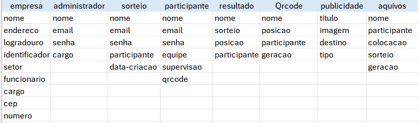
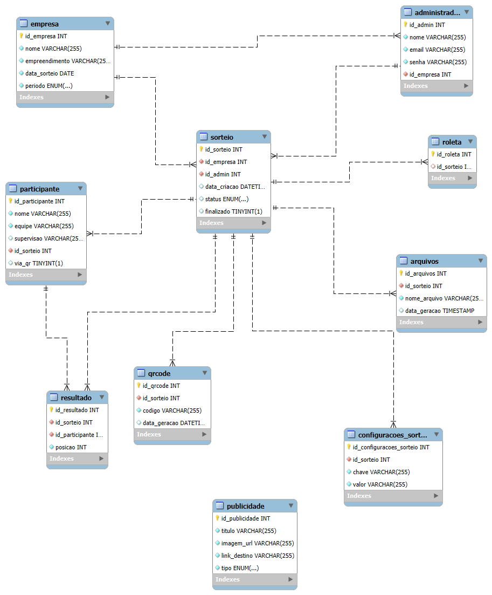

# CRIAÇÃO DO BANCO DE DADOS DA ROLETA – P.I

# Contexto

• Para o nosso Projeto Integrador, cujo o tema trata-se de uma roleta  para ser usada em estabelecimentos, foi criado um banco de dados chamado (roletadb;).

• Logo em seguida, para a estrutura do banco de dados da roleta, foi pensado e definido algumas das identidades principais, sendo elas;
1.	Empresa
2.	Administrador
3.	Participante
4.	Sorteio
5.	Resultado
6.	QRCode
7.	Publicidade - Para anúncios que serão exibidos no site.
8. Arquivos
9.	Caso haja necessidade – Configurações do Sorteio (para futuras personalizações e novas animações) essa entidade ajuda.

# MODELAGEM BANCO DE DADOS

A modelação  do banco de dados foi feito à partir da definição das entidades, pensando nisso, foi realizado a normalização com todos os atributos necessários para esse banco de dados.

# Especificação dos elementos usados no banco de dados.

• Tabelas:

▪ Empresa ▪ empresa_id (Chave Primária) ▪ Nome ▪ empreendimento ▪ data_sorteio ▪ periodo.

Administrador ▪ admin_id (Chave Primária)Nome ▪ Email ▪ Senha ▪ empresa_id (Chave Estrangeira) referenciando a tabela empresa. 

▪ Sorteio ▪ empresa_id (Chave Estrangeira referenciando a tabela empresa) ▪ Administrador (Chave Estrangeira referenciando a tabela administrador)  data da criação ▪ finalizado.

▪ Participante ▪ nome ▪ equipe ▪ Supervisão ▪ sorteio_id ▪ via-qr.

▪ Resultado ▪ resultado-id ▪ sorteio_id ▪ participante-id ▪ posicao. 

▪ QRCode ▪ qr-id ▪ sorteio-id ▪ codigo ▪ data_geracao.

▪ Publicidade ▪ publicidade_id ▪ titulo ▪ imagem_url ▪link-destino ▪ tipo.

▪ Arquivos ▪ arquivos-id ▪ sorteio-id ▪ nome-arquivo ▪ data_geracao.


# Modelo Lógico com as normalizações


## 1 Normalização

## 2 Normalização

## 3 Normalização

# MODELO FISICO - Banco de dados
### Código escrito em sql

```sql create database roletadb; use roletadb;
-- Criação do banco de dados - Roleta para sorteios.
create database roletadb;

-- Criação das tabelas que serão inseridas no banco de dados da roleta da empresa.
create table empresa (
    id_empresa int auto_increment primary key,
    nome varchar(255) not null,
    empreendimento varchar(255) not null,
    data_sorteio date not null,
    periodo enum('Manhã', 'Tarde', 'Integral')  not null
);

-- tabela de administrador 
create table administrador (
    id_admin int auto_increment primary key,
    nome varchar(255) not null,
	email varchar(255) unique not null,
    senha varchar(255) not null, -- seria importante armazenar senha criptografada para evitar possíveis invasões.
	id_empresa int not null,
    FOREIGN KEY (id_empresa) REFERENCES empresa(id_empresa) ON DELETE CASCADE  -- on delete cascade seria interessente adicionar
    -- para caso haja necessidade de apagar alguma tabela que tenha dados referenciados de otra tabela, apaga de ambos e o ponto
    -- positivo disto é que protege a integridadade dos dados e do próprio banco de dados.
);

-- tabela de sorteios
create table sorteio (
	id_sorteio int auto_increment primary key,
    id_empresa int not null,
    id_admin int not null,
    data_criacao datetime default current_timestamp,
    status enum('Aberto', 'Finalizado') default 'Aberto',
    foreign key(id_empresa) references empresa(id_empresa)  on delete cascade,
	foreign key(id_admin) references administrador(id_admin)  on delete cascade
);

-- tabela de participantes 
create table participante (
	id_participante int auto_increment primary key,
	nome varchar(255) not null,
	equipe varchar(255) not null,
	supervisao varchar(255),
	id_sorteio int not null,
	via_qr boolean default false, -- defaulf false, caso nenhum valor seja inserido, o próprio banco de dados
	-- irá entender que nenhum participante foi informado via qrcode.
	unique(id_sorteio, nome), -- unique para evitar nomes duplicados no mesmmo sorteio.
	foreign key (id_sorteio) references sorteio(id_sorteio) on delete cascade
	);

-- tabela de resultados do sorteio
create table resultado (
	id_resultado int auto_increment primary key,
	id_sorteio int not null,
	id_participante int not null,
	posicao int not null,
	foreign key (id_sorteio) references sorteio(id_sorteio) on delete cascade,
	foreign key (id_participante) references participante(id_participante) on delete cascade
);

--  tabela de QR codes para participação da roleta
create table qrcode (
	id_qr int auto_increment primary key,
	id_sorteio int not null, 
	codigo varchar(255) unique not null,
	data_geracao datetime default current_timestamp,
	foreign key (id_sorteio) references sorteio(id_sorteio) on delete cascade
);

-- a tabela publicidade não faz relacão com nenhuma outra tabela, sendo assim, 
-- ela pode ser considerada como tabela independente,
-- sendo utilizada apenas para armazenar innformações de arquivos de anúncios
-- que serão exibidos no sistema.
create table publicidade (
	id_publicidade int auto_increment primary key,
	titulo varchar(255) not null,
	imagem_url varchar(255) not null, -- guarda o endereço da imagem ao clicar na imagem colocada 
	-- na publicidade/anuncio.
	link_destino varchar(255) not null, -- guarda o endereco para onde o usuario será redirecionado
	-- ao clicar na publicidade/anuncio.
    tipo enum ('Rodapé', 'QR_Intermediário', 'QR-Final') not null -- enum significa que pode ser armazenado
    -- um conjunto de valores fixos e limitados.
    -- QR intermediario ou final indica onde, como ele será posicionado no anuncio e exibido no sistema.
);

ALTER TABLE sorteio ADD COLUMN finalizado BOOLEAN DEFAULT FALSE; -- o dowload do pdf da roleta com todos
-- os nomes e posições dos participantes só serão disponibilizados após a finalização do sorteio.
-- sendo assim, antes do sorteio, finalizado = FALSE (ninguém pode baixar).
-- depois do sorteio, finalizado = TRUE (todos podem baixar).

-- dessa forma, será necessário a criação de uma tabela chamada arquivos para armazenar todos os arquivos de pdfs gerados a cada sorteio realizado.
-- assim, podemos manter um histórico dos sorteios.

create table arquivos (
	id_arquivos int auto_increment primary key,
	id_sorteio int not null,
	nome_arquivo varchar(255) not null,
	data_geracao timestamp default current_timestamp,
	foreign key (id_sorteio) references sorteio(id_sorteio) on delete cascade
    -- com essa tabela, será permitido que qualquer participante baixe o arquivo.
);
```

## Modelo de Entidade Relacional

#### Diagrama do relacionamento - ROLETA



